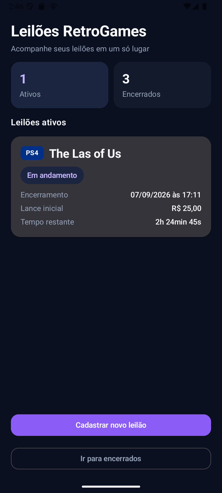
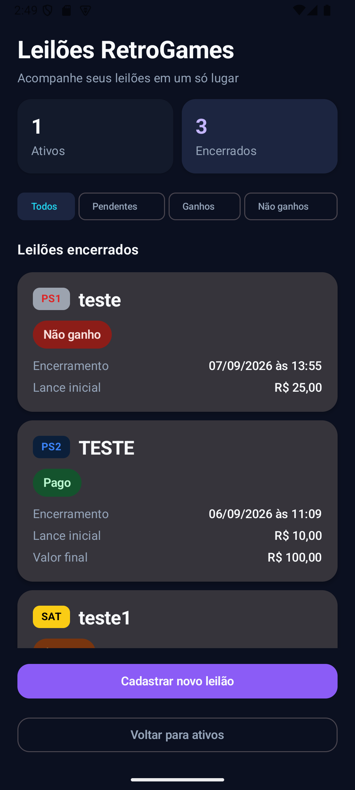
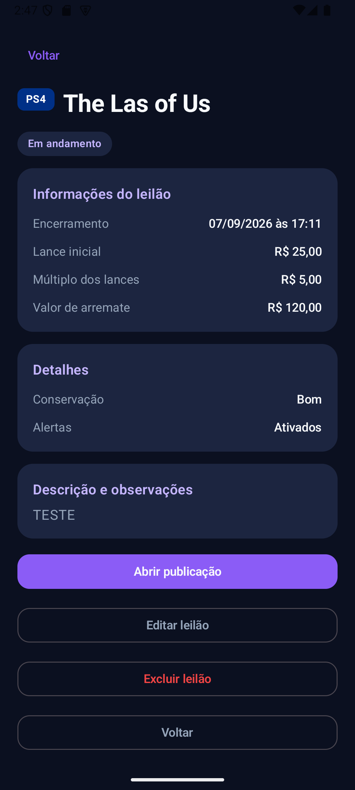
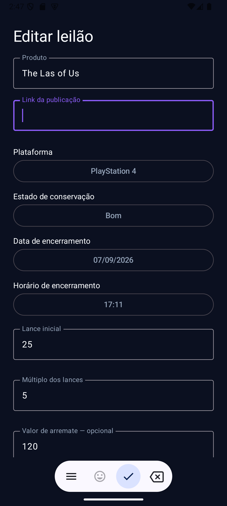
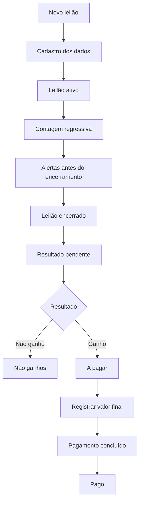

# Leilões RetroGames

<p align="center">
  Aplicativo Android nativo para organizar, acompanhar e gerenciar leilões de jogos, consoles e itens retrô.
</p>

<p align="center">
  
  
  
  
  
</p>

## Demonstração visual

### Leilões ativos

<p align="center">
  
</p>

### Leilões encerrados

<p align="center">
  
</p>

### Detalhes do leilão

<p align="center">
  
</p>

### Cadastro de leilão

<p align="center">
  
</p>

## Sobre o projeto

O **Leilões RetroGames** é um aplicativo Android nativo desenvolvido para facilitar o acompanhamento de leilões de videogames, jogos, consoles, acessórios e outros itens retrô publicados principalmente em grupos e comunidades online.

O aplicativo centraliza os leilões acompanhados pelo usuário, organiza os itens ativos e encerrados, exibe o tempo restante em tempo real e envia alertas antes do encerramento.

Os lances continuam sendo realizados diretamente na publicação original. O aplicativo funciona como uma ferramenta pessoal de organização e acompanhamento.

A aplicação utiliza **Kotlin**, **Jetpack Compose** e **Room**, com funcionamento local e sem necessidade de conta, servidor ou conexão permanente com serviços externos.

## Principais funcionalidades

### Gestão de leilões

* cadastro manual de leilões;
* edição de leilões;
* exclusão com confirmação;
* abertura da publicação original;
* persistência local dos dados;
* seleção da plataforma;
* identificação visual das plataformas por badges;
* registro do estado de conservação;
* descrição e observações;
* valor de lance inicial;
* múltiplo dos lances;
* valor de arremate opcional;
* seleção de data e horário de encerramento;
* validação dos campos do formulário.

### Acompanhamento

* separação entre leilões ativos e encerrados;
* contagem regressiva atualizada em tempo real;
* identificação visual do status;
* navegação rápida entre Ativos e Encerrados;
* priorização de resultados pendentes;
* retorno para a seção de origem após visualizar ou alterar um leilão encerrado.

### Resultados

Os leilões encerrados são organizados em:

* Todos;
* Pendentes;
* Ganhos;
* Não ganhos.

Leilões com resultado ainda não informado são destacados como **Resultado pendente** e priorizados no topo da listagem.

Dentro dos leilões ganhos existem os filtros:

* Todos;
* A pagar;
* Pagos.

Também é possível:

* registrar se o leilão foi ganho ou não;
* informar o valor final do leilão;
* acompanhar itens ganhos ainda pendentes de pagamento;
* marcar o pagamento como concluído.

## Alertas e notificações

Cada leilão pode ter seus alertas ativados ou desativados individualmente.

Quando ativados, o aplicativo agenda notificações locais antes do encerramento nos seguintes intervalos:

* 1 hora;
* 30 minutos;
* 15 minutos;
* 10 minutos;
* 5 minutos.

Os alertas são reagendados quando o horário do leilão é alterado.

Quando os alertas são desativados ou o leilão é excluído, os alarmes anteriormente agendados são cancelados.

O agendamento utiliza o **AlarmManager** do Android e, quando permitido pelo sistema, alarmes exatos.

## Fluxo da aplicação



## Estado de conservação

O aplicativo permite classificar cada item como:

* Ótimo;
* Bom;
* Médio;
* Ruim;
* Péssimo.

Também existe internamente a opção de estado não informado para compatibilidade com registros anteriores.

## Plataformas

O aplicativo possui identificação visual para diferentes plataformas, entre elas:

* PlayStation;
* PlayStation 2;
* PlayStation 3;
* PlayStation 4;
* PlayStation 5;
* PSP;
* PS Vita;
* Xbox;
* Xbox 360;
* Xbox One;
* Dreamcast;
* Sega Saturn;
* Nintendo GameCube;
* Nintendo Wii;
* Wii U;
* Nintendo 64;
* Super Nintendo;
* Mega Drive;
* Game Boy Advance;
* Nintendo DS;
* Nintendo 3DS;
* Nintendo Switch;
* Nintendo Switch 2;
* PC.

Cada plataforma possui badge e identidade visual própria dentro da interface.

## Tecnologias

| Camada                   | Tecnologias                                    |
| ------------------------ | ---------------------------------------------- |
| Linguagem                | Kotlin 2.2.10                                  |
| Interface                | Jetpack Compose, Material 3                    |
| Persistência             | Room 2.8.4                                     |
| Estado                   | ViewModel, StateFlow                           |
| Processamento assíncrono | Kotlin Coroutines                              |
| Alertas                  | AlarmManager, PendingIntent, BroadcastReceiver |
| Splash Screen            | AndroidX Core SplashScreen                     |
| Build                    | Gradle, Android Gradle Plugin                  |
| Versionamento            | Git, GitHub                                    |
| Documentação             | Markdown                                       |

## Arquitetura atual

O projeto está organizado em camadas principais:

```text
leiloes-retro-games/
|
|-- app/
|   `-- src/
|       `-- main/
|           |-- java/br/com/diogozarpelao/leiloesretrogames/
|           |   |-- data/
|           |   |   |-- local/
|           |   |   `-- repository/
|           |   |
|           |   |-- model/
|           |   |-- ui/
|           |   |   |-- screens/
|           |   |   |-- theme/
|           |   |   `-- viewmodel/
|           |   |
|           |   |-- AuctionApplication.kt
|           |   |-- AuctionNotificationReceiver.kt
|           |   |-- AuctionNotificationScheduler.kt
|           |   `-- MainActivity.kt
|           |
|           `-- res/
|
|-- docs/
|   `-- screenshots/
|
|-- gradle/
`-- README.md
```

### Responsabilidades principais

* `model` — modelos e enums do domínio;
* `data/local` — banco de dados Room e DAO;
* `data/repository` — acesso e persistência dos dados;
* `ui/viewmodel` — estado e operações da interface;
* `ui/screens` — telas desenvolvidas com Jetpack Compose;
* `ui/theme` — identidade visual do aplicativo;
* `AuctionNotificationScheduler` — agendamento e cancelamento de alertas;
* `AuctionNotificationReceiver` — recebimento dos alarmes e exibição das notificações;
* `MainActivity` — composição da aplicação e navegação atual.

A navegação da versão atual é controlada diretamente pela `MainActivity`.

## Execução local

### Requisitos

* Android Studio;
* JDK 11 ou compatível;
* Android SDK;
* emulador Android ou dispositivo físico com Android 8.0 ou superior.

### Clonar o projeto

```powershell
git clone https://github.com/diogozarpelo/leiloes-retro-games.git
cd leiloes-retro-games
```

Abra o projeto no Android Studio e aguarde a sincronização do Gradle.

### Testes

Os testes podem ser executados pelo terminal:

```powershell
.\gradlew test
```

### Aplicação

A aplicação pode ser executada diretamente pelo Android Studio em um emulador ou dispositivo físico compatível.

## Persistência local

Os dados são armazenados localmente utilizando **Room**.

A aplicação não depende de servidor externo para armazenar os leilões cadastrados.

A versão atual não utiliza:

* login;
* conta de usuário;
* backend remoto;
* sincronização em nuvem.

Os dados permanecem no dispositivo em que o aplicativo está instalado.

## Testes e qualidade

O aplicativo foi validado durante o desenvolvimento por meio de testes automatizados e testes manuais de fluxo.

Entre as validações realizadas estão:

* cadastro de leilões;
* edição;
* exclusão;
* persistência local;
* validações do formulário;
* seleção de data e horário;
* contagem regressiva;
* transição automática entre ativos e encerrados;
* resultados pendentes;
* registro de leilões ganhos e não ganhos;
* registro do valor final;
* controle de pagamento;
* filtros de encerrados;
* ativação e desativação de alertas;
* reagendamento de notificações;
* cancelamento de alertas;
* navegação entre telas;
* abertura da publicação original.

O desenvolvimento utiliza Git com commits incrementais e versionamento contínuo do código-fonte no GitHub.

## Segurança e privacidade

* os dados permanecem armazenados localmente no aparelho;
* não existe autenticação ou envio dos dados para um servidor próprio;
* não são necessárias credenciais de Facebook;
* o aplicativo apenas abre o link da publicação original;
* dados pessoais reais não devem ser incluídos nas demonstrações públicas;
* screenshots utilizados no portfólio devem utilizar informações fictícias ou anonimizadas.

## Status

A **v1.0 está funcional e validada nos principais fluxos da aplicação**.

A versão atual contempla o escopo principal planejado para acompanhamento pessoal de leilões retrô, incluindo cadastro, organização, alertas, resultados e controle de pagamentos.

O projeto poderá continuar evoluindo com melhorias de arquitetura, cobertura de testes e novas funcionalidades conforme novas necessidades forem identificadas.

## Possíveis evoluções

* ampliar a cobertura de testes;
* avaliar migração da navegação atual para Navigation Compose;
* adicionar novas plataformas conforme necessário;
* aprimorar notificações e opções de personalização;
* avaliar funcionalidades adicionais a partir do uso real do aplicativo.

## Autor

**Diogo Zarpelão**

Desenvolvimento Android, arquitetura da aplicação, modelagem e persistência de dados, interface em Jetpack Compose, sistema de alertas, regras de negócio e documentação técnica.

GitHub: [@diogozarpelo](https://github.com/diogozarpelo)

## Uso

Este repositório é apresentado para fins de estudo, demonstração técnica e portfólio profissional.

Todos os direitos reservados.
